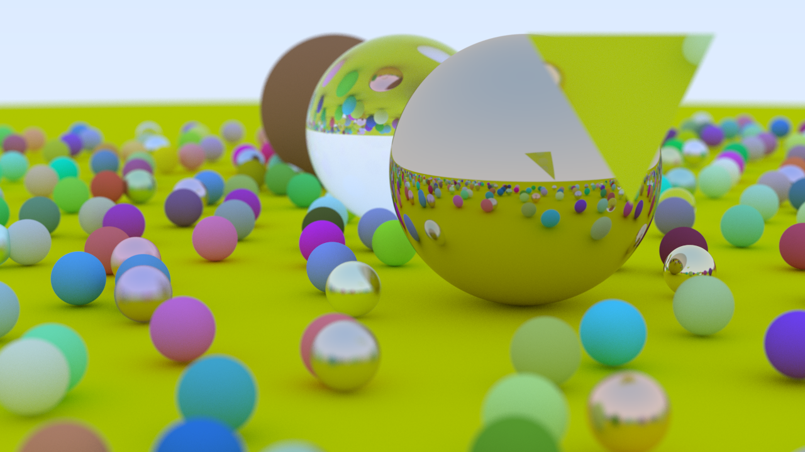

# rustrace
Raytracer in Rust rougly following [Raytracing in One Weekend](https://raytracing.github.io/) plus some of my own additions.

Rendered at 1000 samples per pixel, max bounce depth 50, 1920x1080.

Rendered at 500 samples per pixel, max bounce depth 50, 1280x720.

## Features
- Geometry:
    - Spheres
    - Triangles
    - Triangular meshes
- Materials:
    - Lambertian (diffuse),
    - Dielectric,
    - Metal.
- Anti-Aliasing:
    - Grid,
    - Random.
- Defocus Blur. 
- Parallelised using Rayon.
- BVH tree to speed up intersection detection.

## To-Do
- [ ] Other geometry.
    - [x] Triangles
    - [ ] Triangular meshes from OBJs
        - [x] Basic OBJ parsing
        - [x] Normal interpolation
        - [ ] Clean up implementation
        - [ ] Look at optimisations
            - [x] Surface area heuristic splitting
        - [ ] Setting position, scale, etc. (transforms) for meshes
- [ ] Clean up `camera.rs`.
- [ ] Texturing.
- [ ] Lighting.
- [ ] Transforms.
- [ ] Volumetrics.
- [ ] Command line image output configuration.
- [ ] Better documentation!
    - [x] `aabb.rs`
    - [ ] `bvh.rs`
        - [x] Documentation
        - [ ] Doc tests
    - [ ] `camera.rs`
        - [x] Documentation
        - [ ] Doc tests
    - [x] `hit.rs`
    - [x] `hit_list.rs`
    - [x] `interval.rs`
    - [x] `material.rs`
        - [x] Documentation
        - [ ] Doc tests
    - [ ] `mesh.rs`
        - [x] Documentation
        - [ ] Doc tests
    - [x] `ray.rs`
    - [x] `sphere.rs`
        - [x] Documentation
        - [ ] Doc tests
    - [ ] `triangle.rs`
        - [x] Documentation
        - [ ] Doc tests
    - [x] `utils.rs`
    - [ ] `vec3.rs`
