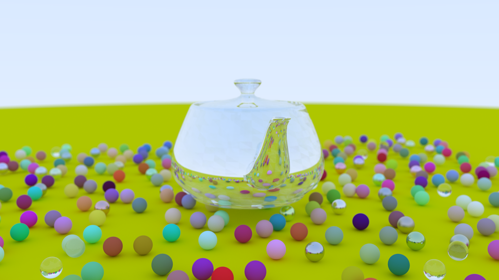

# rustrace
Raytracer in Rust rougly following [Raytracing in One Weekend](https://raytracing.github.io/).

## Features
- Spheres only right now.
- Materials:
    - Lambertian (diffuse),
    - Dielectric,
    - Metal.
- Anti-Aliasing:
    - Grid,
    - Random.
- Defocus Blur. 
- Parallelised using Rayon.
- BVH tree to speed up intersection detection.

## To-Do
- [ ] Profile `par_iter` over pixels into a buffer against current method to see if line mutex locking and releasing is causing slow-downs
- [ ] Other geometry (tri's and OBJ parsing).
- [ ] Texturing.
- [ ] Lighting.
- [ ] Transforms.
- [ ] Volumetrics.
- [ ] Command line image output configuration.
